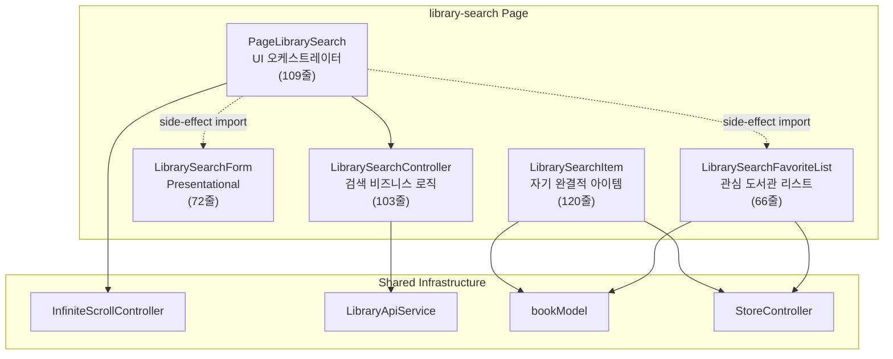

# Library Search 페이지 재분석 (리팩토링 후)

## 1. 리팩토링 전후 비교

### 줄 수 변화

| 파일 | Before | After | 변화 |
|------|--------|-------|------|
| PageLibrarySearch.ts | 217 | 109 | **-50%** |
| LibrarySearchController.ts | — | 103 | 신규 |
| LibrarySearchItem.ts | 106 | 120 | +14 (자체 로직 추가) |
| LibrarySearchFavoriteList.ts | 66 | 66 | 변경 없음 |
| LibrarySearchForm.ts | 72 | 72 | 변경 없음 |
| index.ts | 28 | 28 | 변경 없음 |
| library-search.html | 68 | 35 | **-49%** |
| **총합** | **557** | **533** | **-4%** (줄 수 유지, 구조 개선) |

### 아키텍처 개선 요약

| 항목 | Before | After |
|------|--------|-------|
| 페이지 역할 | 상태+API+렌더링 혼재 | **UI/이벤트 전용** (109줄) |
| 검색 로직 | 페이지에 직결 | **LibrarySearchController** 분리 |
| 아이템 selected | 부모 prop 전달 | **자체 모델 구독 (getter)** |
| 체크박스 변경 | 부모 이벤트 위임 | **아이템 자체 처리** |
| bookModel 의존 | 3개 컴포넌트 | **2개** (Item, FavoriteList만) |
| 에러 표시 | 토스트 + 인라인 이중 | **인라인만 (통일)** |
| HTML 마크업 | 미사용 template 3개 | **깔끔한 minimal 마크업** |

### 현재 의존성 다이어그램



> [!TIP]
> `PageLibrarySearch`가 `bookModel`에 대한 의존성을 **완전히 해소**하여, 순수 UI 레이어로 확립되었습니다.

---

## 2. 현재 구조의 강점 ✅

1. **명확한 관심사 분리**: 각 컴포넌트가 정확히 하나의 역할만 수행
2. **ReactiveController 일관성**: `LibrarySearchController`, `StoreController`, `InfiniteScrollController` 3가지 Controller가 통일된 패턴
3. **자기 완결적 아이템**: `LibrarySearchItem`이 읽기(`selected` getter) + 쓰기(`handleChange`) 모두 자체 처리
4. **에러 전략 통일**: `CustomFetch`는 순수 전송 계층, 에러 표시는 호출 측이 결정
5. **성능 기반**: CSS `content-visibility: auto`, `repeat()`, `debounce`, `AbortController`
6. **접근성**: `aria-live`, `role`, `manageFocus()`, visually-hidden, 포커스 링

---

## 3. 잔여 개선 가능 영역 🔧

### 3-1. SCSS `.notFound` dead style

```scss
// library-search.scss 280-283행
.notFound {
    margin: 1rem;
    text-align: center;
}
```

현재 Lit 컴포넌트는 `.no-data` 클래스를 사용하며(PageLibrarySearch 91행), `.notFound`는 제거된 `<template>` 태그에서 사용하던 클래스입니다. **Dead style 제거** 대상입니다.

---

### 3-2. `LibrarySearchForm`의 `keyword` prop 동기화 불필요 패턴

```typescript
// PageLibrarySearch.ts
<library-search-form
    .keyword="${keyword}"    // ← Controller의 keyword를 Form에 전달
    @search="${this.handleSearch}"
    @input-change="${this.handleInput}"
></library-search-form>
```

현재 `keyword`를 Form에 전달하지만, Form은 `input.value`를 직접 관리하고 있어 이 바인딩이 검색 후 입력값을 갱신하는 용도로만 사용됩니다. `trim()` 후 키워드가 Form에 역으로 반영되는 것은 의도적일 수 있으나, 실질적으로 **사용자가 입력한 키워드와 Controller의 키워드가 다를 수 있는 시점**이 존재합니다 (debounce 중간). 현재로서는 문제가 되지 않으므로 **낮은 우선순위**입니다.

---

### 3-3. `index.ts` Custom Element 등록 패턴 간소화

```typescript
// 현재: 6개의 if-guard 블록
if (!customElements.get("nav-gnb")) {
    customElements.define("nav-gnb", NavGnb);
}
// ... x6
```

반복되는 `if (!customElements.get(...))` 체크를 헬퍼 함수로 추출하면 가독성이 향상됩니다:

```typescript
function defineIfNeeded(name: string, constructor: CustomElementConstructor) {
    if (!customElements.get(name)) customElements.define(name, constructor);
}

defineIfNeeded("nav-gnb", NavGnb);
defineIfNeeded("error-fallback", ErrorFallback);
// ...
```

단, 이 패턴이 다른 페이지의 `index.ts`에서도 사용된다면 **프로젝트 범위의 유틸리티**로 추출하는 것이 효과적입니다.

---

### 3-4. `InfiniteScrollController`와 `updated()` 결합

```typescript
// PageLibrarySearch.ts
updated() {
    this.infiniteScroll.setPaused(
        this.searchController.loading || !this.searchController.hasMoreData()
    );
}
```

매 업데이트마다 `setPaused`를 호출합니다. `LibrarySearchController`가 `loading` 변경 시 자동으로 `InfiniteScrollController`에 알리는 구조로 발전시킬 수 있지만, 현재 수준에서는 **충분히 간결하고 명확**하여 복잡성을 추가할 이유가 없습니다.

---

## 4. 결론

현재 `library-search` 페이지는 **바닐라 JS + Lit 기반 프로젝트에서 달성할 수 있는 최적의 아키텍처 수준**에 도달했습니다.

- 컴포넌트 간 의존성이 최소화됨
- 비즈니스 로직과 UI가 깔끔하게 분리됨
- 성능 최적화 기법이 적절히 적용됨

잔여 개선(3-1 ~ 3-3)은 **코드 위생** 수준의 사소한 항목이며, 아키텍처 변경이 필요한 항목은 없습니다.
