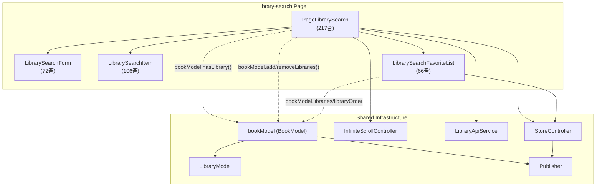
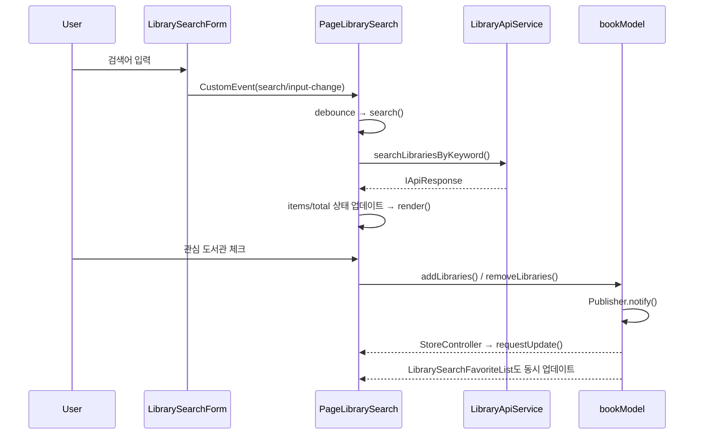

# Library Search 페이지 구조 분석 및 개선 방향

## 1. 현재 구조 개요

### 파일 구성 (5개 파일, 총 ~489줄)

| 파일 | 줄 수 | 역할 |
|------|-------|------|
| [PageLibrarySearch.ts](file:///Users/deokim/Documents/코딩/project-my/book-world/app/src/scripts/pages/library-search/PageLibrarySearch.ts) | 217 | 페이지 오케스트레이터 (검색 로직 + 상태 관리 + 렌더링) |
| [LibrarySearchForm.ts](file:///Users/deokim/Documents/코딩/project-my/book-world/app/src/scripts/pages/library-search/LibrarySearchForm.ts) | 72 | 검색 폼 (Presentational) |
| [LibrarySearchItem.ts](file:///Users/deokim/Documents/코딩/project-my/book-world/app/src/scripts/pages/library-search/LibrarySearchItem.ts) | 106 | 도서관 아이템 카드 (Presentational) |
| [LibrarySearchFavoriteList.ts](file:///Users/deokim/Documents/코딩/project-my/book-world/app/src/scripts/pages/library-search/LibrarySearchFavoriteList.ts) | 66 | 관심 도서관 리스트 (StoreController 연동) |
| [index.ts](file:///Users/deokim/Documents/코딩/project-my/book-world/app/src/scripts/pages/library-search/index.ts) | 28 | Custom Element 등록 |

### 의존성 다이어그램



### 데이터 흐름



---

## 2. 현재 구조의 강점 ✅

### 잘 설계된 부분

1. **ReactiveController 패턴 활용**
   - [StoreController](file:///Users/deokim/Documents/%EC%BD%94%EB%94%A9/project-my/book-world/app/src/scripts/utils/StoreController.ts#4-35): Publisher-Subscriber를 Lit 생명주기에 자연스럽게 녹임
   - [InfiniteScrollController](file:///Users/deokim/Documents/%EC%BD%94%EB%94%A9/project-my/book-world/app/src/scripts/utils/InfiniteScrollController.ts#9-74): IntersectionObserver를 깔끔하게 캡슐화
   - **자동 구독 해제** ([hostDisconnected](file:///Users/deokim/Documents/%EC%BD%94%EB%94%A9/project-my/book-world/app/src/scripts/utils/InfiniteScrollController.ts#33-36))로 메모리 누수 방지

2. **관심사 분리**
   - [LibrarySearchForm](file:///Users/deokim/Documents/%EC%BD%94%EB%94%A9/project-my/book-world/app/src/scripts/pages/library-search/LibrarySearchForm.ts#3-72): 순수 Presentational 컴포넌트 (CustomEvent로만 통신)
   - [LibrarySearchItem](file:///Users/deokim/Documents/%EC%BD%94%EB%94%A9/project-my/book-world/app/src/scripts/pages/library-search/LibrarySearchItem.ts#3-105): 데이터 표시 전용
   - [LibrarySearchFavoriteList](file:///Users/deokim/Documents/%EC%BD%94%EB%94%A9/project-my/book-world/app/src/scripts/pages/library-search/LibrarySearchFavoriteList.ts#6-66): 독립적인 스토어 연동

3. **성능 최적화 기반 마련**
   - CSS `content-visibility: auto` 적용 (SCSS 214줄)
   - `repeat()` directive로 DOM 재활용
   - [debounce](file:///Users/deokim/Documents/%EC%BD%94%EB%94%A9/project-my/book-world/app/src/scripts/utils/helpers.ts#56-78)로 과도한 API 호출 방지
   - `AbortController`로 이전 요청 취소

4. **접근성(a11y) 고려**
   - `aria-live="polite"`, `role="list/listitem/search"` 적용
   - [manageFocus()](file:///Users/deokim/Documents/%EC%BD%94%EB%94%A9/project-my/book-world/app/src/scripts/utils/helpers.ts#34-55)로 동적 콘텐츠 포커스 관리
   - visually-hidden 패턴 사용

---

## 3. 개선 가능 영역 🔧

### 3-1. HTML 마크업의 불필요한 `<template>` 태그

[library-search.html](file:///Users/deokim/Documents/코딩/project-my/book-world/app/src/markup/library-search.html)에 3개의 `<template>` 태그가 남아있습니다:

```html
<template id="tp-notFound">...</template>
<template id="tp-error">...</template>
<template id="tp-library-search-item">...</template>
```

> [!IMPORTANT]
> [PageLibrarySearch](file:///Users/deokim/Documents/%EC%BD%94%EB%94%A9/project-my/book-world/app/src/scripts/pages/library-search/PageLibrarySearch.ts#12-218)는 Lit의 [html](file:///Users/deokim/Documents/%EC%BD%94%EB%94%A9/project-my/book-world/app/build/html/library-search.html) 템플릿을 사용하여 렌더링하므로, 이 `<template>` 요소들은 **전혀 참조되지 않습니다**. Lit 마이그레이션 이전의 잔재물입니다.

**제안**: 3개의 `<template>` 태그를 제거합니다.

---

### 3-2. [PageLibrarySearch](file:///Users/deokim/Documents/%EC%BD%94%EB%94%A9/project-my/book-world/app/src/scripts/pages/library-search/PageLibrarySearch.ts#12-218)의 책임 과다 (217줄)

현재 [PageLibrarySearch](file:///Users/deokim/Documents/%EC%BD%94%EB%94%A9/project-my/book-world/app/src/scripts/pages/library-search/PageLibrarySearch.ts#12-218)가 담당하는 역할:

| 역할 | 줄 범위 | 줄 수 |
|------|---------|------|
| 상태 선언 (8개 속성) | 13~36 | 24 |
| 컨트롤러 초기화 | 38~55 | 18 |
| 검색/loadMore/retry 로직 | 63~139 | 77 |
| 이벤트 핸들러 | 148~171 | 24 |
| 렌더링 | 175~216 | 42 |

> [!NOTE]
> 217줄은 절대적으로 크진 않지만, **비즈니스 로직(API 호출 + 상태 전이) + 이벤트 핸들링 + 렌더링**이 모두 한 클래스에 있어, 향후 기능 추가(필터링, 정렬 등) 시 급격히 비대해질 수 있습니다.

**제안 방향: 비즈니스 로직을 별도 Controller로 분리**

```
[현재]
PageLibrarySearch = 상태 + API 호출 + UI

[목표]
LibrarySearchController = 상태 + API 호출 (ReactiveController)
PageLibrarySearch = UI + 이벤트 위임
```

- `LibrarySearchController`가 `keyword`, `page`, `items`, `loading`, `error`, `total` 등의 상태와 [search()](file:///Users/deokim/Documents/%EC%BD%94%EB%94%A9/project-my/book-world/app/src/scripts/pages/library-search/PageLibrarySearch.ts#63-91), [loadMore()](file:///Users/deokim/Documents/%EC%BD%94%EB%94%A9/project-my/book-world/app/src/scripts/pages/library-search/PageLibrarySearch.ts#92-99), [fetchData()](file:///Users/deokim/Documents/%EC%BD%94%EB%94%A9/project-my/book-world/app/src/scripts/services/CustomFetch.ts#80-99) 등의 검색 로직을  소유
- [PageLibrarySearch](file:///Users/deokim/Documents/%EC%BD%94%EB%94%A9/project-my/book-world/app/src/scripts/pages/library-search/PageLibrarySearch.ts#12-218)는 Controller의 상태를 읽어 렌더링만 담당
- 이미 [StoreController](file:///Users/deokim/Documents/%EC%BD%94%EB%94%A9/project-my/book-world/app/src/scripts/utils/StoreController.ts#4-35), [InfiniteScrollController](file:///Users/deokim/Documents/%EC%BD%94%EB%94%A9/project-my/book-world/app/src/scripts/utils/InfiniteScrollController.ts#9-74)를 사용하는 패턴이 확립되어 있으므로 일관성도 높아짐

---

### 3-3. [StoreController](file:///Users/deokim/Documents/%EC%BD%94%EB%94%A9/project-my/book-world/app/src/scripts/utils/StoreController.ts#4-35) 중복 구독 구조

[PageLibrarySearch](file:///Users/deokim/Documents/%EC%BD%94%EB%94%A9/project-my/book-world/app/src/scripts/pages/library-search/PageLibrarySearch.ts#12-218)와 [LibrarySearchFavoriteList](file:///Users/deokim/Documents/%EC%BD%94%EB%94%A9/project-my/book-world/app/src/scripts/pages/library-search/LibrarySearchFavoriteList.ts#6-66) 모두 `BookModelEvent.LibraryUpdate`를 구독합니다:

```typescript
// PageLibrarySearch.ts (43행)
new StoreController(this, bookModel.getPublisher(BookModelEvent.LibraryUpdate));

// LibrarySearchFavoriteList.ts (12행)  
new StoreController(this, bookModel.getPublisher(BookModelEvent.LibraryUpdate));
```

**분석**: [PageLibrarySearch](file:///Users/deokim/Documents/%EC%BD%94%EB%94%A9/project-my/book-world/app/src/scripts/pages/library-search/PageLibrarySearch.ts#12-218)에서 이 이벤트를 구독하는 목적은 `bookModel.hasLibrary(item.libCode)`로 체크박스 상태를 업데이트하기 위함입니다(render 209줄). [LibrarySearchFavoriteList](file:///Users/deokim/Documents/%EC%BD%94%EB%94%A9/project-my/book-world/app/src/scripts/pages/library-search/LibrarySearchFavoriteList.ts#6-66)는 독자적인 관심 도서관 목록을 렌더링합니다.

> [!TIP]
> [PageLibrarySearch](file:///Users/deokim/Documents/%EC%BD%94%EB%94%A9/project-my/book-world/app/src/scripts/pages/library-search/PageLibrarySearch.ts#12-218)가 구독하는 대신, [LibrarySearchItem](file:///Users/deokim/Documents/%EC%BD%94%EB%94%A9/project-my/book-world/app/src/scripts/pages/library-search/LibrarySearchItem.ts#3-105)이 자체적으로 [StoreController](file:///Users/deokim/Documents/%EC%BD%94%EB%94%A9/project-my/book-world/app/src/scripts/utils/StoreController.ts#4-35)를 통해 `selected` 상태를 내부에서 결정하면, 부모-자식 간 props 전달 스텝과 부모의 불필요한 리렌더를 제거할 수 있습니다.

**제안**: [LibrarySearchItem](file:///Users/deokim/Documents/%EC%BD%94%EB%94%A9/project-my/book-world/app/src/scripts/pages/library-search/LibrarySearchItem.ts#3-105)이 `bookModel.hasLibrary()`를 직접 호출하고 [StoreController](file:///Users/deokim/Documents/%EC%BD%94%EB%94%A9/project-my/book-world/app/src/scripts/utils/StoreController.ts#4-35)로 구독

```typescript
// 개선된 LibrarySearchItem (개념)
class LibrarySearchItem extends LitElement {
    constructor() {
        super();
        new StoreController(this, bookModel.getPublisher(BookModelEvent.LibraryUpdate));
    }
    
    get selected() {
        return this.data ? bookModel.hasLibrary(this.data.libCode) : false;
    }
    // selected를 외부 prop으로 받지 않음 → PageLibrarySearch의 LibraryUpdate 구독 제거 가능
}
```

**효과**:
- [PageLibrarySearch](file:///Users/deokim/Documents/%EC%BD%94%EB%94%A9/project-my/book-world/app/src/scripts/pages/library-search/PageLibrarySearch.ts#12-218)에서 `LibraryUpdate` 구독 제거 → 관심 도서관 변경 시 전체 리스트 리렌더 방지
- 각 [LibrarySearchItem](file:///Users/deokim/Documents/%EC%BD%94%EB%94%A9/project-my/book-world/app/src/scripts/pages/library-search/LibrarySearchItem.ts#3-105)만 자기 상태를 업데이트 → 더 세밀한 업데이트
- 단, N개의 아이템이 각각 구독하는 대신, 개별 아이템의 render가 가볍기 때문에 실질적 성능 차이는 미미할 수 있음

---

### 3-4. `handleListChange` 이벤트 위임의 개선 여지

```typescript
private handleListChange = (e: Event) => {
    const target = e.target as HTMLInputElement;
    if (target && target.name === "myLibrary") {
        const itemElement = target.closest("library-search-item") as LibrarySearchItem;
        if (!itemElement || !itemElement.data) return;
        const data = itemElement.data;
        // ...
    }
};
```

> [!NOTE]
> Light DOM에서의 이벤트 위임은 유효한 패턴이지만, `closest()` + `.data` 접근은 **컴포넌트 캡슐화를 깨뜨립니다**. 부모가 자식의 내부 구조(`.data` 프로퍼티)에 직접 의존합니다.

**대안 A** (CustomEvent 활용):
[LibrarySearchItem](file:///Users/deokim/Documents/%EC%BD%94%EB%94%A9/project-my/book-world/app/src/scripts/pages/library-search/LibrarySearchItem.ts#3-105)이 체크박스 변경 시 CustomEvent를 dispatch하여, 부모가 내부 구조를 알 필요가 없도록 함

**대안 B** (3-3과 연계):
[LibrarySearchItem](file:///Users/deokim/Documents/%EC%BD%94%EB%94%A9/project-my/book-world/app/src/scripts/pages/library-search/LibrarySearchItem.ts#3-105)이 직접 `bookModel.add/removeLibraries()`를 호출하면, 이 이벤트 핸들러 자체가 불필요해짐

---

### 3-5. `loading` 상태와 무한 스크롤 제어의 결합

```typescript
// PageLibrarySearch.ts
updated(changedProperties: PropertyValues) {
    if (changedProperties.has("loading") || changedProperties.has("items")) {
        this.infiniteScroll.setPaused(this.loading || !this.hasMoreData());
    }
}
```

이 로직은 비즈니스 로직의 Controller 분리 시(3-2) Controller 내부로 이동시킬 수 있습니다.

---

### 3-6. 에러 처리 이중 구조

```typescript
// PageLibrarySearch.ts → fetchData()
// CustomFetch.ts → fetch()에서 이미 에러 토스트 표시

// PageLibrarySearch.ts에서도:
this.error = "데이터를 불러오는 중 오류가 발생했습니다.";
```

[CustomFetch](file:///Users/deokim/Documents/%EC%BD%94%EB%94%A9/project-my/book-world/app/src/scripts/services/CustomFetch.ts#6-101)에서 `showToast(errorMessage)` 후 re-throw → [PageLibrarySearch](file:///Users/deokim/Documents/%EC%BD%94%EB%94%A9/project-my/book-world/app/src/scripts/pages/library-search/PageLibrarySearch.ts#12-218)에서 catch 후 `this.error` 설정 + UI에 `error-fallback` 표시. **토스트 + 인라인 에러가 동시에 표시됩니다.**

**제안**: 어느 한 쪽으로 통일
- [CustomFetch](file:///Users/deokim/Documents/%EC%BD%94%EB%94%A9/project-my/book-world/app/src/scripts/services/CustomFetch.ts#6-101)의 토스트를 제거하고, 에러 표시를 호출 측에 위임 (더 유연)
- 또는 [fetchData](file:///Users/deokim/Documents/%EC%BD%94%EB%94%A9/project-my/book-world/app/src/scripts/services/CustomFetch.ts#80-99)에서 `error-fallback` 전용 에러 메시지만 설정하고 토스트를 제거

> [!WARNING]
> 이 부분은 [CustomFetch](file:///Users/deokim/Documents/%EC%BD%94%EB%94%A9/project-my/book-world/app/src/scripts/services/CustomFetch.ts#6-101)를 사용하는 다른 페이지에도 영향을 미치므로, 전체 에러 전략에 대한 통일된 정책이 필요합니다.

---

## 4. 개선 우선순위 및 권장 로드맵

| 우선순위 | 항목 | 난이도 | 효과 |
|---------|------|-------|------|
| **1** | HTML `<template>` 잔재물 제거 (3-1) | ⭐ | 코드 위생, Dead code 제거 |
| **2** | [LibrarySearchItem](file:///Users/deokim/Documents/%EC%BD%94%EB%94%A9/project-my/book-world/app/src/scripts/pages/library-search/LibrarySearchItem.ts#3-105) 자체 모델 구독 (3-3, 3-4) | ⭐⭐ | 불필요한 리렌더 방지, 캡슐화 향상 |
| **3** | 비즈니스 로직 Controller 분리 (3-2) | ⭐⭐⭐ | 테스트 용이성, 확장성 |
| **4** | 에러 처리 전략 통일 (3-6) | ⭐⭐ | UX 일관성 (프로젝트 전반 영향) |

---

## 5. 요약

현재 [library-search](file:///Users/deokim/Documents/%EC%BD%94%EB%94%A9/project-my/book-world/app/build/js/library-search) 페이지는 **이미 높은 수준의 설계**로 되어있습니다. `ReactiveController` 패턴, CSS `content-visibility`, `AbortController`, [debounce](file:///Users/deokim/Documents/%EC%BD%94%EB%94%A9/project-my/book-world/app/src/scripts/utils/helpers.ts#56-78), 접근성 등 모범적인 기법이 적용되어 있습니다.

주요 개선 방향은:
1. **Dead code 정리** — HTML 마크업의 미사용 `<template>` 제거
2. **렌더링 효율화** — [LibrarySearchItem](file:///Users/deokim/Documents/%EC%BD%94%EB%94%A9/project-my/book-world/app/src/scripts/pages/library-search/LibrarySearchItem.ts#3-105)의 자체 모델 구독으로 부모 리렌더 범위 축소
3. **관심사 분리 심화** — 검색 로직을 `LibrarySearchController`로 분리하여 테스트 가능성과 확장성 확보
4. **에러 전략 통일** — [CustomFetch](file:///Users/deokim/Documents/%EC%BD%94%EB%94%A9/project-my/book-world/app/src/scripts/services/CustomFetch.ts#6-101)와 페이지 레벨 에러 표시의 중복 해소
