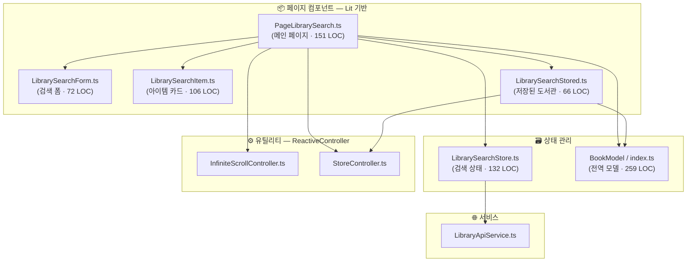
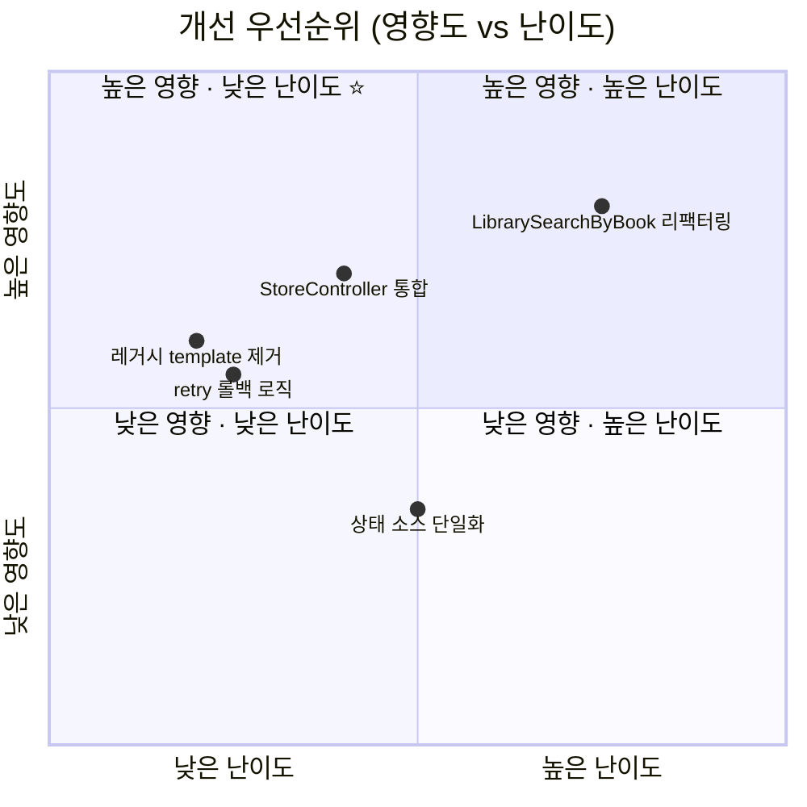

# Library-Search 페이지 아키텍처 분석 보고서

> 작성일: 2026-02-26

---

## 1. 현재 구조 개요

### 파일 구성



### 데이터 흐름

```mermaid
sequenceDiagram
    participant U as 👤 사용자
    participant F as LibrarySearchForm
    participant P as PageLibrarySearch
    participant S as LibrarySearchStore
    participant A as LibraryApiService
    participant B as BookModel

    rect rgb(40, 60, 40)
    Note over U,A: 🔍 검색 흐름
    U->>F: 키워드 입력 / 엔터
    F->>P: CustomEvent (search / input-change)
    P->>S: search(keyword) / debouncedSearch
    S->>A: searchLibrariesByKeyword()
    A-->>S: 응답 (IApiResponse)
    S-->>P: notify (handleStoreUpdate)
    P->>P: _state 갱신 → re-render
    end

    rect rgb(40, 40, 60)
    Note over P,A: 📜 무한 스크롤
    P->>S: loadMore() via InfiniteScrollController
    S->>A: fetchData (page + 1)
    A-->>S: 추가 데이터
    S-->>P: notify → append items
    end

    rect rgb(60, 40, 40)
    Note over U,B: ⭐ 관심 도서관 토글
    U->>P: checkbox change (Event Delegation)
    P->>B: addLibraries / removeLibraries
    B-->>P: StoreController → requestUpdate
    end
```



---

## 2. 아키텍처 강점 ✅

### 2.1 선언적 렌더링 + Light DOM
- Lit의 `html` 템플릿 리터럴로 **선언적 UI** 구현
- `createRenderRoot() { return this; }`로 Light DOM 유지 → 전역 CSS 공유, Shadow DOM 오버헤드 제거

### 2.2 관심사 분리가 우수

| 레이어 | 역할 | 파일 |
|--------|------|------|
| **View** | 렌더링, 이벤트 위임 | `PageLibrarySearch`, `LibrarySearchItem`, `LibrarySearchForm`, `LibrarySearchStored` |
| **State** | 검색 상태 관리, API 호출 | `LibrarySearchStore` |
| **Model** | 전역 도서관/즐겨찾기 영속 | `BookModel` |
| **Service** | HTTP 통신 추상화 | `LibraryApiService` |
| **Controller** | 횡단 관심사 | `InfiniteScrollController`, `StoreController` |

### 2.3 이미 적용된 성능 최적화

| 기법 | 설명 |
|------|------|
| `content-visibility: auto` | CSS 기반 렌더링 스킵 (브라우저 네이티브 가상 스크롤) |
| Event Delegation | 리스트 checkbox `change` 이벤트를 부모에서 단일 핸들러로 처리 |
| AbortController | 검색 요청 중복 방지 (이전 요청 자동 취소) |
| Debounce (300ms) | 실시간 입력 시 불필요한 API 호출 방지 |
| `repeat()` directive | `libCode` 키 기반 효율적 DOM diffing |

### 2.4 ReactiveController 패턴
- `InfiniteScrollController` : IntersectionObserver 로직을 호스트 컴포넌트 생명주기에 자동 바인딩
- `StoreController` : BookModel 구독/해제를 생명주기에 위임 → 메모리 누수 방지

---

## 3. 개선 가능한 지점 ⚠️

### 3.1 이중 구독 패턴 (Store + Model 동시 구독)

`PageLibrarySearch`에서 **두 가지 상태 소스를 동시 구독**합니다:

```typescript
// 1) LibrarySearchStore — 수동 구독 (connectedCallback)
librarySearchStore.subscribe(this.handleStoreUpdate);

// 2) BookModel — StoreController 자동 관리
new StoreController(this, BookModelEvent.LibraryUpdate);
```

> ⚠️ 두 가지 구독 메커니즘이 혼재하여 **일관성이 부족**합니다.

**개선 방향**: `LibrarySearchStoreController` (ReactiveController)를 만들어 수동 subscribe/unsubscribe 제거

---

### 3.2 HTML 레거시 `<template>` 태그 잔존

`library-search.html`에 `<template>` 태그 3개가 남아있으나 **실제로는 사용되지 않습니다**:

```html
<!-- Lit render()가 이미 대체 → Dead Code -->
<template id="tp-notFound">...</template>
<template id="tp-error">...</template>
<template id="tp-library-search-item">...</template>
```

별도 `templates/library-search-item.html` 파일도 잔존합니다.

**개선**: 미사용 `<template>` 태그 및 HTML 파일 제거 → 코드 혼란 방지

---

### 3.3 외부 모델 직접 참조

```typescript
// render() 내부에서 bookModel을 직접 호출
.selected=${bookModel.hasLibrary(item.libCode)}
```

`hasLibrary()`는 O(1) 조회라 **성능 문제는 없으나**, 렌더 시점에 외부 모델을 직접 참조하는 것은 데이터 흐름의 명시성을 떨어뜨립니다.

**가능한 개선**: 검색 스토어에 `selectedCodes: Set<string>`을 포함시켜 단일 상태 소스로 통합 (우선순위 낮음)

---

### 3.4 `getState()` 얕은 복사 비용

```typescript
public getState(): LibrarySearchState {
    return { ...this.state };  // 매 호출마다 새 객체 생성
}
```

현재 규모에서 측정 가능한 영향은 미미하나, 빈번한 객체 생성은 GC 압박 가능성이 있습니다.

---

### 3.5 에러 복구 흐름 단절

> ⚠️ `loadMore()` 도중 에러 발생 시 `page`가 이미 증가된 상태에서 retry하면 **중간 페이지 데이터가 누락**될 수 있습니다.

```typescript
public async retry() {
    if (this.state.loading) return;
    this.setState({ loading: true, error: null });
    await this.fetchData();  // page가 이미 증가된 상태
}
```

**개선**: retry 시 page 롤백 로직 추가

---

### 3.6 `LibrarySearchByBook.ts` 레거시 패턴 잔존

같은 도메인이지만 **완전히 다른 아키텍처**:

| 비교 항목 | LibrarySearch (최신) | LibrarySearchByBook (레거시) |
|-----------|---------------------|------------------------------|
| 기반 클래스 | `LitElement` | `HTMLElement` 직접 상속 |
| 렌더링 | 선언적 `html` 템플릿 | 명령형 DOM 조작 |
| 상태 관리 | Store + ReactiveController | 없음 |
| 에러 처리 | `error-fallback` 컴포넌트 | `console.warn`만 |
| API 호출 | `LibraryApiService` | `CustomFetch` 직접 호출 |

---

## 4. 개선 우선순위 매트릭스



| 순위 | 개선 항목 | 난이도 | 영향도 | 비고 |
|:----:|-----------|:------:|:------:|------|
| 🥇 | 레거시 `<template>` / 미사용 HTML 제거 | ⭐ | 유지보수↑ | 즉시 가능, 부작용 없음 |
| 🥈 | `LibrarySearchStoreController` 도입 | ⭐⭐ | 일관성↑ | 수동 구독 제거, 코드 ~15줄 감소 |
| 🥉 | `retry()` 페이지 롤백 로직 | ⭐ | 안정성↑ | 에지 케이스 버그 방지 |
| 4 | `LibrarySearchByBook` Lit 리팩터링 | ⭐⭐⭐ | 일관성↑↑ | 별도 작업으로 분리 |
| 5 | 상태 소스 단일화 (`selected` 통합) | ⭐⭐ | 명시성↑ | 현재 성능 이슈 없으므로 저우선 |

---

## 5. 추천 구현 예시

### 5.1 `LibrarySearchStoreController` (ReactiveController 통합)

```typescript
// utils/LibrarySearchStoreController.ts
import { ReactiveController, ReactiveControllerHost } from "lit";
import { librarySearchStore, LibrarySearchState } from "@/model/LibrarySearchStore";

export class LibrarySearchStoreController implements ReactiveController {
    private host: ReactiveControllerHost;
    state: LibrarySearchState;

    constructor(host: ReactiveControllerHost) {
        (this.host = host).addController(this);
        this.state = librarySearchStore.getState();
    }

    private handleUpdate = (newState?: LibrarySearchState) => {
        if (!newState) return;
        this.state = newState;
        this.host.requestUpdate();
    };

    hostConnected() {
        librarySearchStore.subscribe(this.handleUpdate);
    }

    hostDisconnected() {
        librarySearchStore.unsubscribe(this.handleUpdate);
    }
}
```

적용 시 `PageLibrarySearch`가 간소화됩니다:

```diff
 // PageLibrarySearch.ts
-private _state: LibrarySearchState;
+private searchStore = new LibrarySearchStoreController(this);

-connectedCallback() {
-    super.connectedCallback();
-    librarySearchStore.subscribe(this.handleStoreUpdate);
-}
-disconnectedCallback() {
-    super.disconnectedCallback();
-    librarySearchStore.unsubscribe(this.handleStoreUpdate);
-}
-private handleStoreUpdate = (...) => { ... };

 render() {
-    const { keyword, items, ... } = this._state;
+    const { keyword, items, ... } = this.searchStore.state;
 }
```

### 5.2 `retry()` 페이지 롤백

```diff
 // LibrarySearchStore.ts
+private lastSuccessfulPage = 0;

 private async fetchData() {
     try {
         if (response.status === "success") {
+            this.lastSuccessfulPage = this.state.page;
             // ...기존 성공 로직
         }
     } catch (error) {
+        this.setState({
+            page: this.lastSuccessfulPage || 1,
+            loading: false,
+            error: "...",
+        });
     }
 }
```

---

## 6. 결론

현재 `library-search` 페이지는 **바닐라 JS 프로젝트 기준으로 매우 견고한 아키텍처**를 갖추고 있습니다. Lit + Publisher + ReactiveController의 조합은 프레임워크 수준의 반응성과 생명주기 관리를 제공하면서도 번들 크기를 최소화합니다.

개선 방향은 **"기존 패턴의 일관성 강화"**에 집중하는 것이 가장 효율적입니다. 특히 **`LibrarySearchStoreController` 도입**과 **레거시 템플릿 정리**는 최소 비용으로 코드 품질을 높일 수 있는 즉시 실행 가능한 개선입니다.
