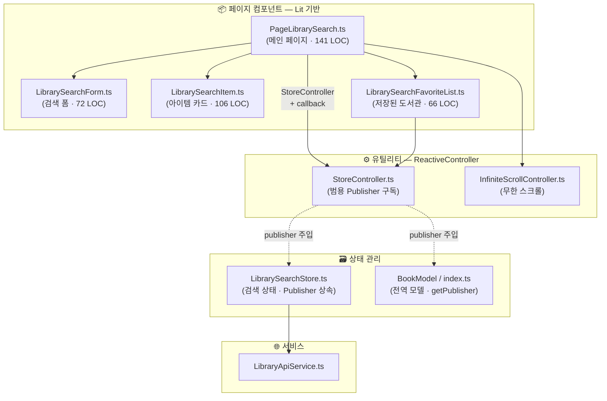
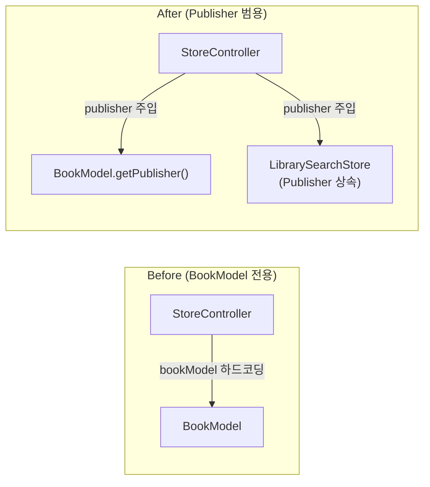
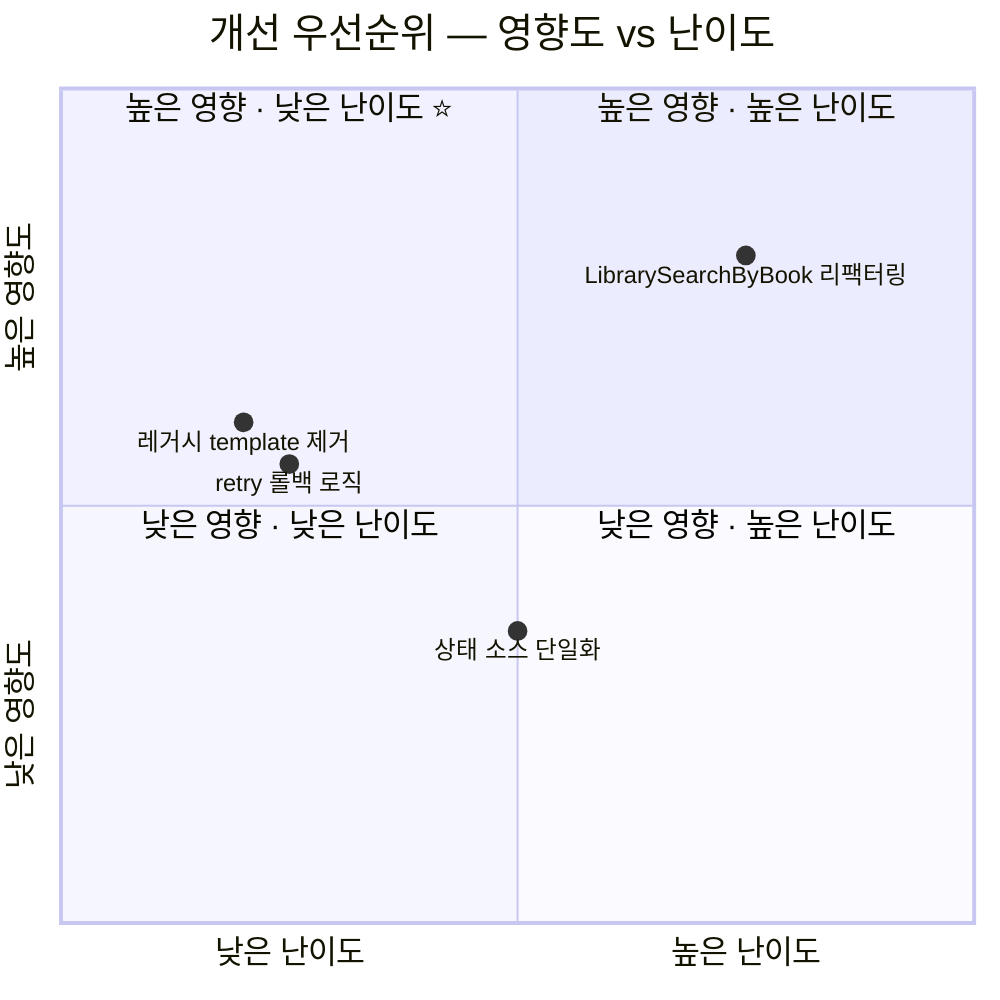

# Library-Search 페이지 아키텍처 분석 보고서

> 작성일: 2026-02-26 (v2 — StoreController 범용화 반영)

---

## 1. 현재 구조 개요

### 파일 구성



### 핵심 변경: `StoreController` 범용화



`StoreController`가 `Publisher<T>`를 직접 받는 범용 Controller로 진화하여:
- **BookModel** → `bookModel.getPublisher(event)` 로 Publisher 직접 전달
- **LibrarySearchStore** → `Publisher` 상속이므로 인스턴스 자체를 전달
- 전용 `LibrarySearchStoreController` 파일 **제거** → 파일 수 감소

### 데이터 흐름


---

## 2. 아키텍처 강점 ✅

### 2.1 `StoreController` 하나로 모든 구독 통합

```typescript
// BookModel 구독 — Publisher를 직접 주입
new StoreController(this, bookModel.getPublisher(BookModelEvent.LibraryUpdate));

// LibrarySearchStore 구독 — Publisher 상속이므로 그 자체를 주입
new StoreController(this, librarySearchStore, this.handleStoreUpdate);
```

| 특징 | 설명 |
|------|------|
| **단일 API** | 모든 Publisher 기반 구독을 `StoreController` 하나로 처리 |
| **자동 생명주기** | `hostConnected/hostDisconnected`에서 subscribe/unsubscribe 자동 관리 |
| **선택적 콜백** | 콜백 없으면 `requestUpdate()` 트리거, 있으면 콜백으로 부수 효과 처리 |

### 2.2 성능 최적화 기법 (적용 완료)

| 기법 | 위치 | 설명 |
|------|------|------|
| `content-visibility: auto` | SCSS | 브라우저 네이티브 렌더링 스킵 |
| Event Delegation | `PageLibrarySearch` | checkbox `change` 이벤트를 부모에서 단일 핸들러로 처리 |
| AbortController | `LibrarySearchStore` | 검색 요청 중복 방지 (이전 요청 자동 취소) |
| Debounce (300ms) | `PageLibrarySearch` | 실시간 입력 시 불필요한 API 호출 방지 |
| `repeat()` directive | `PageLibrarySearch` | `libCode` 키 기반 효율적 DOM diffing |
| Light DOM | 전체 | Shadow DOM 오버헤드 제거, 전역 CSS 공유 |

### 2.3 관심사 분리

| 레이어 | 역할 | 파일 |
|--------|------|------|
| **View** | 렌더링, 이벤트 위임 | 4개 Lit 컴포넌트 |
| **State** | 검색 상태 + API 호출 | `LibrarySearchStore` |
| **Model** | 전역 영속 데이터 | `BookModel` |
| **Controller** | 횡단 관심사 (구독, 스크롤) | `StoreController`, `InfiniteScrollController` |
| **Service** | HTTP 추상화 | `LibraryApiService` |

---

## 3. 개선 가능한 지점 ⚠️

### 3.1 레거시 HTML `<template>` 잔존

`library-search.html`에 Lit `render()`로 이미 대체된 `<template>` 태그 3개가 잔존:

```html
<template id="tp-notFound">...</template>     <!-- Dead Code -->
<template id="tp-error">...</template>         <!-- Dead Code -->
<template id="tp-library-search-item">...</template>  <!-- Dead Code -->
```

별도 `templates/library-search-item.html` 파일도 잔존.  
→ **즉시 삭제 가능, 부작용 없음**

---

### 3.2 `retry()` 페이지 롤백 미처리

`loadMore()` 도중 에러 발생 시 `page`가 이미 증가된 상태에서 retry하면 **중간 페이지 데이터 누락 가능**:

```typescript
public async retry() {
    this.setState({ loading: true, error: null });
    await this.fetchData();  // page가 이미 증가된 상태
}
```

개선안:

```diff
+private lastSuccessfulPage = 0;

 private async fetchData() {
     try {
         if (response.status === "success") {
+            this.lastSuccessfulPage = this.state.page;
         }
     } catch (error) {
+        this.setState({ page: this.lastSuccessfulPage || 1, ... });
     }
 }
```

---

### 3.3 외부 모델 직접 참조

```typescript
.selected=${bookModel.hasLibrary(item.libCode)}  // render() 내부에서 외부 모델 직접 호출
```

`hasLibrary()`는 O(1) 조회이므로 **성능 문제는 아니지만** 데이터 흐름 명시성이 떨어짐.  
→ 우선순위 낮음 (현재 구조에서 실질적 이점 미미)

---

### 3.4 `LibrarySearchByBook.ts` 레거시 패턴

같은 도메인이지만 `HTMLElement` 직접 상속, 명령형 DOM 조작, Store 없음 등 **완전히 다른 아키텍처** 사용.  
→ Lit 기반 리팩터링 별도 작업 권장

---

## 4. 개선 우선순위



| 순위 | 개선 항목 | 난이도 | 비고 |
|:----:|-----------|:------:|------|
| 🥇 | 레거시 `<template>` / 미사용 HTML 제거 | ⭐ | 즉시 가능, 부작용 없음 |
| 🥈 | `retry()` 페이지 롤백 로직 | ⭐ | 에지 케이스 버그 방지 |
| 🥉 | `LibrarySearchByBook` Lit 리팩터링 | ⭐⭐⭐ | 별도 작업 분리 |
| 4 | 상태 소스 단일화 (`selected` 통합) | ⭐⭐ | 저우선 |

---

## 5. 결론

`StoreController`의 범용 Publisher 기반 리팩터링으로 **전용 Controller 파일이 제거**되어 구조가 한 단계 더 간결해졌습니다. 현재 `library-search` 페이지는 **10개 소스 파일**로 구성되며, 바닐라 JS 프로젝트 기준으로 매우 견고한 아키텍처를 갖추고 있습니다.

남은 개선은 **정리 작업(레거시 template 제거)**과 **방어적 코딩(retry 롤백)** 수준이며, 아키텍처 설계 자체는 이미 성숙한 상태입니다.
